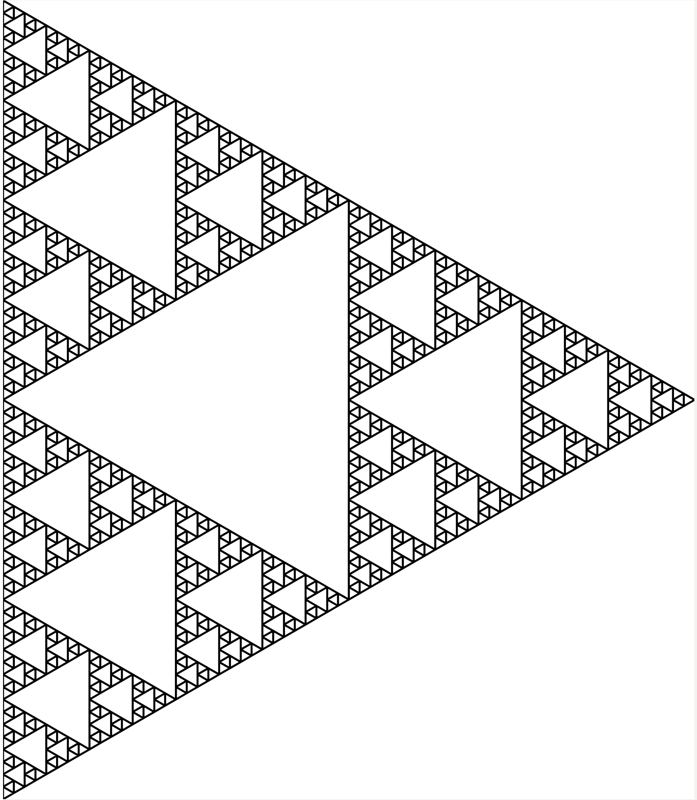

# Lindenmayer SVG Draw Tool

This Lindenmayer SVG Draw Tool can be used to generate self-similar fractals in an SVG format. 

This tool was built using Rust, WebAssembly and the Svelte web framework demonstrating how Rust can be used to generate WebAssembly code that is run within the browser as an alternative to JavaScript or TypeScript.

The above image is of a 'Sierpinski Triangle' generated using the tool.  

## How to use the Tool

First visit the URL [https://lindenmayer.netlify.app/](https://lindenmayer.netlify.app/), then specify inputs using the boxes on the right and click 'Draw' to run the algorithm. 
Alternatively, click 'Use Example' to populate the fields with an example and then click 'Draw'.

## How the specified instructions affect the diagram

1. The string in the 'Axiom' input box is the inital string
2. The tool will iterate across the sequence of characters in this string and replace each character with a new string. Each 'm' found is replaced by the text in the 'Replace m with' input box, each 'l' found is replaced by the text in the 'Replace l with' input box and each 'f' found is replaced by the text in the 'Replace f with' input box.
3. Step 2 is repeated using the string outputted from the previous run. This continues for the number of recursions specified by 'Number of Recursions'.
4. The algorithm will then iterate across the string resulting from step 3 and translate each character into a drawing instruction as follows: 

* 'm' moves the cursor forward without drawing a line
* 'l' draws a line from the current position forward to the new position
* 'f' also draws a line from the current position forward to the new position
* '+' increases the angle of movement by the number of degrees specified by the 'Angle Shift' input
* '-' decreases the angle of movemement by the number of degrees specifies by the 'Angle Shift' input
* '[' stores current position in memory
* ']' pulls the last position in memory and overwrites the current position

Note that the default 'forward' direction is up the screen (zero degree angle).

Changing the 'Stroke Width' will change the thickness of the lines of the diagram. If there appears to be no diagram it could be that the line thickness is too thin for the diagram to be visible. Try increasing the stroke width until the diagram becomes visible.

## Where can I get ideas for inputs to try out?

The Wikipedia page on L-sytem is a good source for design ideas: https://en.wikipedia.org/wiki/L-system.

By clicking 'Use Example' you are using the approach for 'Example 2: fractal (binary) tree'

## Dependencies required when running this code locally

* yarn
* Svelte
* wasm-pack

For more info on converting Rust to WASM please consult the following guide:  
 https://developer.mozilla.org/en-US/docs/WebAssembly/Rust_to_Wasm
